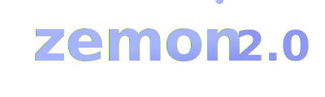

<div align="center">
  

  <h1>
    
    Zemon 2.0
    
  </h1>

  <p>
    <em>Where Music Meets Productivity: The Next-Gen Team Collaboration Platform</em>
  </p>

  <p>
    <a href="https://zemon-2.vercel.app">
      
    </a>
  </p>

  <p>
    <a href="https://github.com/Zemon-tech/zemon-2.0/stargazers">
      
    </a>
    <a href="https://github.com/Zemon-tech/zemon-2.0/network/members">
      
    </a>
    <a href="https://github.com/Zemon-tech/zemon-2.0/issues">
      
    </a>
  </p>
</div>

<hr/>

## 🎯 About The Project

Zemon 2.0 is a revolutionary team collaboration platform that combines productivity tools with music integration. Our platform helps teams work better together while enjoying a shared musical experience.

### 🌟 Why Zemon 2.0?

- **Music-Powered Productivity**: Integrate SoundCloud playlists into your workflow
- **Real-time Collaboration**: Stay connected with team members instantly
- **Smart Task Management**: Organize work with intuitive tools
- **Seamless Integration**: Works with your existing tools and workflows
- **Cross-Platform**: Access from any device, anywhere

<div align="center">
  <h3>🛠️ Built With Modern Tech Stack</h3>
  <p>
    
    
    
    
    
    
  </p>
</div>

## 💫 Features

<div align="center">
  <table>
    <tr>
      <td align="center" width="33%">
        
        <br/>
        <b>Task Management</b>
        <br/>
        <sub>
          • Kanban boards<br/>
          • Task assignments<br/>
          • Progress tracking<br/>
          • Priority management
        </sub>
      </td>
      <td align="center" width="33%">
        
        <br/>
        <b>Real-time Chat</b>
        <br/>
        <sub>
          • Team channels<br/>
          • Direct messages<br/>
          • File sharing<br/>
          • Rich media support
        </sub>
      </td>
      <td align="center" width="33%">
        
        <br/>
        <b>Music Integration</b>
        <br/>
        <sub>
          • SoundCloud API<br/>
          • Shared playlists<br/>
          • Music controls<br/>
          • Activity syncing
        </sub>
      </td>
    </tr>
  </table>
</div>

## 🎮 Demo & Screenshots

<div align="center">
  
  
</div>

## 🚀 Quick Start

```bash
# Clone repository
git clone https://github.com/Zemon-tech/zemon-2.0.git

# Install dependencies
cd zemon-2.0
npm install

# Start development servers
npm run dev
```

<details>
<summary>📋 View detailed setup instructions</summary>

### Prerequisites
- Node.js 18.x or higher
- MongoDB database
- npm or yarn package manager

### Environment Setup
Create `.env` files in both frontend and backend directories:

```env
# Backend (.env)
MONGODB_URI=your_mongodb_uri
JWT_SECRET=your_jwt_secret
PORT=5000
SOUNDCLOUD_API_KEY=your_key

# Frontend (.env)
VITE_API_URL=http://localhost:5000
```

### Development Mode
```bash
# Start backend server
cd backend
npm run dev

# Start frontend (new terminal)
cd frontend
npm run dev
```
</details>

## 📊 Project Stats

<div align="center">
  
  
  
</div>

## 👥 Core Team & Contributors

<div align="center">
  <table>
    <tr>
      <td align="center">
        <a href="https://github.com/Zemon-tech">
          
          <br/>
          <sub><b>Zemon Tech</b></sub>
        </a>
        <br/>
        <sub>Project Lead</sub>
        <br/>
        <a href="https://github.com/Zemon-tech">
          
        </a>
      </td>
      <!-- Add more team members here with their roles and contributions -->
    </tr>
  </table>

  ### 🌟 Special Thanks
  - [Contributor 1] - Feature Development
  - [Contributor 2] - UI/UX Design
  - [Contributor 3] - Testing & Documentation
</div>

## 📘 Documentation

Visit our [Wiki](https://github.com/Zemon-tech/zemon-2.0/wiki) for detailed documentation on:
- Architecture Overview
- API Documentation
- Deployment Guide
- Contributing Guidelines
- Feature Roadmap

## 🤝 Contributing

We welcome contributions! Here's how you can help:

1. 🍴 Fork the repository
2. 🌿 Create your feature branch (`git checkout -b feature/AmazingFeature`)
3. 💾 Commit your changes (`git commit -m 'Add some AmazingFeature'`)
4. 📤 Push to the branch (`git push origin feature/AmazingFeature`)
5. 🔄 Open a Pull Request

## 🌟 Show Your Support

<div align="center">
  <p>If you find this project useful, give it a ⭐️!</p>
  
  <a href="https://github.com/Zemon-tech/zemon-2.0/stargazers">
    
  </a>
</div>

<div align="center">
  <br/>
  <p>
    <sub>Built with ❤️ by the Zemon Team</sub>
  </p>
  <p>
    <a href="https://github.com/Zemon-tech">
      
    </a>
  </p>
</div>


